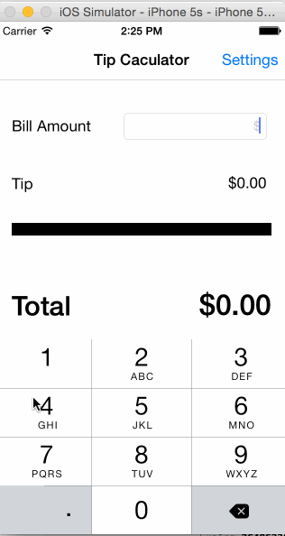

# tip-calculator

This is a Tip Calculator application for iOS submitted as the [pre-assignment](https://gist.github.com/timothy1ee/7747214) requirement for CodePath.

Time spent: 1.5 hours

Completed:

* [X] Required: User can enter a bill amount, choose a tip percentage, and see the tip and total values.
* [X] Required: Settings page to change the default tip percentage.
* [X] Optional: Can customize tip percentages.
* [X] Optional: Making sure the keyboard is always visible and the bill amount is always the first responder. 

